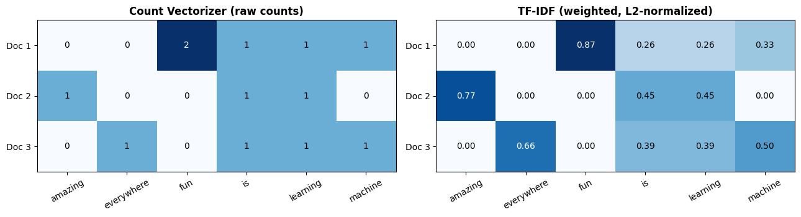

# 🧮 Text to Numbers: Bag of Words, Count Vectorizer & TF-IDF

[](https://colab.research.google.com/github/MMujtabaX/BOW/blob/main/BOW_Count_Vector_%26_TFIDF_DS16.ipynb)


Machine learning models can't read words, only numbers. This notebook shows how text becomes feature vectors with the classic **Bag of Words** family: raw word counts with `CountVectorizer`, then importance-weighted features with `TfidfVectorizer`, verified by calculating TF-IDF by hand.

<p align="center">
  
</p>

## 🧩 The Corpus

```python
corpus = [
    "Machine learning is fun fun",
    "Learning is amazing",
    "Machine learning is everywhere",
]
```

## 1️⃣ Count Vectorizer: Raw Word Counts

Each document becomes a row and each unique word a column. A cell holds how many times that word appears.

|       | amazing | everywhere | fun | is | learning | machine |
|-------|:-------:|:----------:|:---:|:--:|:--------:|:-------:|
| Doc 1 | 0 | 0 | **2** | 1 | 1 | 1 |
| Doc 2 | 1 | 0 | 0 | 1 | 1 | 0 |
| Doc 3 | 0 | 1 | 0 | 1 | 1 | 1 |

**The problem:** `is` and `learning` appear in *every* document, so they tell us nothing about what makes a document different, yet they get the same weight as the meaningful words.

## 2️⃣ TF-IDF: Weighting by Importance

TF-IDF multiplies how often a word appears in a document (**TF**) by how rare it is across the corpus (**IDF**):

$$\text{TF-IDF}(t, d) = \text{TF}(t, d) \times \text{IDF}(t), \qquad \text{IDF}(t) = \ln\frac{1 + n}{1 + \text{df}(t)} + 1$$

**IDF weights from the notebook:**

| Word | Appears in | IDF |
|------|-----------|-----|
| amazing, everywhere, fun | 1 of 3 docs | **1.693** |
| machine | 2 of 3 docs | 1.288 |
| is, learning | 3 of 3 docs | 1.000 (lowest) |

**Resulting TF-IDF matrix** (each row L2-normalized):

|       | amazing | everywhere | fun | is | learning | machine |
|-------|:-------:|:----------:|:---:|:--:|:--------:|:-------:|
| Doc 1 | 0 | 0 | **0.871** | 0.257 | 0.257 | 0.331 |
| Doc 2 | **0.767** | 0 | 0 | 0.453 | 0.453 | 0 |
| Doc 3 | 0 | **0.663** | 0 | 0.391 | 0.391 | 0.504 |

Now each document's **most distinctive word stands out**: `fun`, `amazing` and `everywhere`. Words shared by every document are pushed down.

✅ The notebook recalculates IDF by hand and confirms it **matches scikit-learn exactly**, so the formula is understood rather than just called.

## ⚖️ Comparison

| | Bag of Words | Count Vectorizer | TF-IDF |
|--|--------------|------------------|--------|
| What it is | The concept | An implementation of BoW | An enhancement of BoW |
| Values | Word occurrences | Integer counts | Float importance scores |
| Common words | Dominate | Dominate | **Down-weighted** |
| Word order | Ignored | Ignored | Ignored |
| Best for | Understanding the idea | Simple baselines, Naive Bayes | Search, document similarity, text classification |

**A shared limitation:** all three ignore word order and meaning. *"not good"* and *"good"* look almost identical, and *"movie"* and *"film"* are unrelated columns. That's what **word embeddings** (Word2Vec, GloVe) and **transformers** solve next.

## 🚀 Run It

Click the **Open in Colab** badge above and choose **Runtime → Run all**.

```bash
pip install scikit-learn pandas numpy matplotlib
```

## 🔮 Next Steps

- Use **n-grams** (`ngram_range=(1, 2)`) so phrases like *"not good"* become features
- Train a sentiment classifier on IMDB and compare Count vs TF-IDF features
- Move on to word embeddings (Word2Vec, GloVe)

## 🙏 Acknowledgements

Based on NLP course material; TF-IDF implementation, manual verification and visualization completed by me.

## 👤 Author

**Muhammad Mujtaba Khan Suri** — CS @ UBIT, University of Karachi
[GitHub](https://github.com/MMujtabaX)
